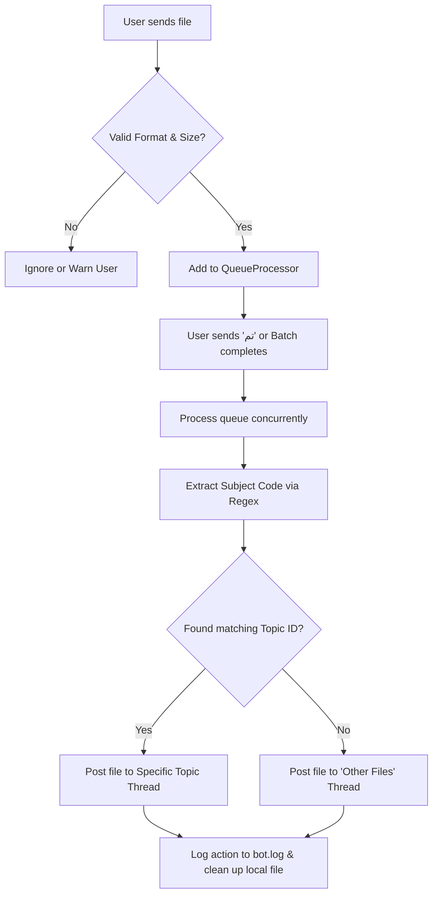

# 🤖 MDJ Archive & Sorter Telegram Bot

An asynchronous, queue-based, auto-sorting Telegram bot built to manage, tag, and organize academic resources (like PDFs, PPTs, PPTXs) inside a forum-topic enabled Telegram supergroup.

---

## 🎯 Goals of the Bot

When managing academic resources for multiple courses in a Telegram group, manually organizing files is extremely tedious and error-prone. This bot solves that problem by:
- Ingesting student-uploaded documents in batches.
- Checking validity, files types, and file sizes.
- **Automatically classifying** files according to academic subject codes (e.g., `MGT-301`, `ISLAM-101`) found inside their filenames.
- **Routing** the files to their respective topic threads within a forum-enabled Telegram supergroup.
- Providing moderation tools, automatic activity changelogs, and usage stats.

---

## 🛠️ How It Works

1. **User Submission**: Users send files (PDF, PPT, PPTX) to the bot in a private chat. The bot validates each file against size limits (max 150MB), extensions, and bad-word filters.
2. **Asynchronous Queueing**: Instead of sending files to Telegram immediately (which easily triggers rate limit crashes), the files are stored in a thread-safe `asyncio.Queue`.
3. **Processing Activation**: When the user finishes uploading their files and sends the word **`تم` (Done)**, the bot triggers the `QueueProcessor`.
4. **Subject Extraction**: For each file, the processor runs a regular expression search to detect course codes (e.g., matching `mgt301` or `MGT 301` and converting it to `MGT-301`).
5. **Telegram Topic Routing**: If a matching course is found, the file is posted to that course's topic thread in the supergroup (using the Telegram API `message_thread_id`). Otherwise, it goes to a fallback topic thread.
6. **Log Parsing & Changelogs**: The bot maintains an incremental log pointer. Every few hours, it reads newly added lines in `bot.log` to compile a report of files uploaded per subject and publishes it to a channel.

---

## 🧠 Most Hard & Unique Features

### 1. Asynchronous Queue Processor with User Serialization
To avoid hitting Telegram's strict rate limits (especially when multiple users upload multiple files concurrently), the bot uses a sophisticated queue:
- **Rate-Limiting**: Enforces strict user rate-limiting (e.g., max 40 files/min per user) and global rate-limiting (e.g., max 400 files/min).
- **User-Level Serialization**: Ensures files from the same user are processed sequentially to guarantee order and avoid overlapping API requests, while still supporting multiple concurrent upload sessions.
- **Estimator Status Updates**: While processing, the bot dynamically updates a status message every 10 seconds, estimating the remaining time for the user based on the average delay (`FILE_PROCESS_DELAY`).

### 2. Regex-Based Academic Subject Classifier
To correctly sort files, the bot contains a dynamic regex matching module:
- Matches pattern `([A-Za-z]+)[-\s]?(\d{3})` case-insensitively.
- Normalizes variations (e.g., `MGT 301`, `mgt-301`, `MGT301` all resolve to `MGT-301`).
- Mappings are defined in `config.py` which links the standardized subject codes to Telegram topic ID forum threads.

### 3. Self-Parsing Incremental Changelog System
Unlike typical apps that require a heavy database engine (like SQLite/PostgreSQL) to store activity for reports, this bot uses a lightweight, self-parsing log mechanism:
- Uses a file pointer seek method (`f.seek(self.last_position)`) to read only the *newly added* lines in `bot.log` since the last execution.
- Parses these logs to extract files moved from topic to topic.
- Aggregates stats dynamically and outputs a beautifully formatted summary (e.g. `📚 MGT-301: 5 files`) into a dedicated channel.

### 4. Group Message Chain Deletion & Bulk Sorting
- **Bulk Sorter (`/ss`)**: Allows admins to bulk-move files. The bot copies a sequence of messages sequentially (`starting_message.message_id + 1`) and sends them to the correct topic, deleting the originals automatically.
- **Message Chain Deletion (`/delete`)**: Admins can clean up group chats by replying to a starting message with `/delete 10` to delete that message and the next 9 replies in the conversation chain.

---

## 📋 Command Reference

### General Commands
- `/start` - Displays the welcome message and instructions.
- `تم` - Process your queued files.
- `/tagme` - Toggle whether your name is shown as the uploader in file captions.

### Administrative Commands
- `/s [subject-code]` - Sort the replied-to file to the specified subject topic.
- `/ss [subject-code] [count]` - Bulk sort the replied-to file and the next `count` files.
- `/bup [user_id]` - Block a user from using the bot.
- `/unbup [user_id]` - Unblock a user.
- `/updateserror` - View the naming violation logs.
- `/delete [count]` - Delete a chain of messages starting from the replied-to message.
- `/del` - Delete the single message being replied to.

### Stats & Logging Commands
- `/stats` or `/lastupdates` - View bot statistics (manual update).
- `/autostats` - Toggle automatic stats updates in the group.
- `/lastlog` - Force compile and send the latest changelog report.
- `/autolog` - Toggle automatic scheduled changelogs.
- `/sendlog` - Send a manual changelog.
- `/resetlog` - Clear the log file history and reset the tracker pointer.
- `/addlog` - Open a private admin prompt to write a custom announcement changelog with confirmation buttons.

---

For installation, configuration, and execution instructions, please see [SETUP.md](SETUP.md).

---

## 📄 License

This project is licensed under the terms of the GNU General Public License v3.0 (GPL-3.0). See the [LICENSE](LICENSE) file for details.
